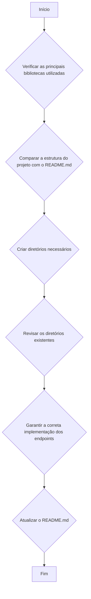

# Lista de Tarefas para venue-connect-sound-srv

- [ ] Verificar as principais bibliotecas utilizadas: Flask-Migrate, Flask-RESTful, Flask-Script e Flask-SQLAlchemy.
- [ ] Criar os diretórios para `bands`, `venues` e `shows` sob o diretório `endpoints`.
- [ ] Revisar os diretórios `todos` e `users` existentes em sua estrutura.
- [ ] Garantir que os endpoints de API estejam corretamente implementados nos arquivos `resource.py` sob os diretórios `todos` e `users`.
- [ ] Atualizar o arquivo README.md para refletir o estado atual do seu projeto, incluindo a estrutura correta do projeto e a descrição precisa dos endpoints da API.
- [ ] Criar testes unitários.

## Diagrama mermaid de fluxo:

